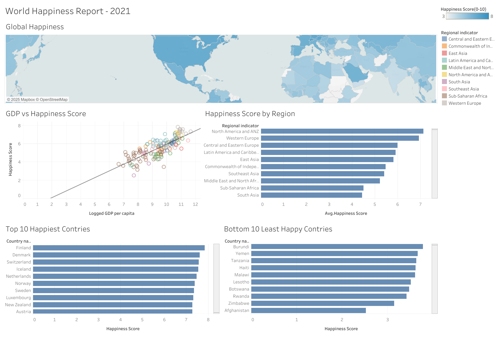

# World Happiness Report – 2021 (Tableau)

A Tableau dashboard analyzing global happiness scores and their relationship with GDP, regional factors, and social indicators.  
The goal is to visually compare how different regions rank in overall well-being and understand what contributes to happiness around the world.

---

## Live Visualization
[View on Tableau Public](https://public.tableau.com/app/profile/chandrika.patibandla1429/viz/WorldHappinessReport-2021/WorldHappinessReport-2021)

---

## Project Overview
This project visualizes the **World Happiness Report 2021** data to explore variations in happiness across countries and regions.  
It combines multiple perspectives—economic, social, and geographic—to reveal global patterns of well-being.

Key questions explored:
- Which countries are the happiest and least happy?
- How does GDP per capita correlate with happiness?
- Which regions consistently score higher or lower in well-being?

---

## Dataset

| File | Description | Location |
|------|--------------|-----------|
| `world-happiness-report-2021.csv` | Source data from the World Happiness Report (2021 edition) | `/data/` |

**Main fields used**
- `Country name`  
- `Regional indicator`  
- `Ladder score` (overall happiness score)  
- `Logged GDP per capita`  
- `Social support`, `Freedom`, `Generosity`, `Healthy life expectancy`

---

## Data Preparation
1. Imported the 2021 dataset (CSV) into Tableau.  
2. Verified country-region mapping and removed null values.  
3. Created calculated fields:
   ```text
   Happiness Score = [Ladder score]
   GDP per Capita (log) = [Logged GDP per capita]
4. Aggregated averages by region for comparisons.
5. Built extracted data connections for performance.
---
## Dashboard Design

**Sections:**
- **Global Happiness Map** – Color-graded by Happiness Score (0–10 scale).
- **GDP vs Happiness** – Scatter plot showing positive correlation between income and well-being.
- **Happiness Score by Region** – Regional averages highlighting Western Europe and North America as top performers.
- **Top 10 / Bottom 10 Countries** – Ranked bar charts for quick comparison.
---

## Insights
- Western Europe and North America are the happiest regions globally, averaging scores above 7.
- GDP per capita shows a strong positive correlation with happiness.
- Sub-Saharan Africa and South Asia display the lowest ladder scores (< 4).
- Despite economic factors, social support and freedom contribute significantly to higher scores.

---
## Dashboard Preview

<p align="center">
  
</p>

<p align="center"><em>Figure: Global distribution and comparison of happiness across regions and economic factors.</em></p>

---

## Tools and Skills

| Category            | Tools / Techniques                                                  |
|---------------------|---------------------------------------------------------------------|
| Data Visualization  | Tableau Desktop (Dashboards, Actions, Parameters)                  |
| Data Preparation    | Excel, CSV cleaning                                                 |
| Analytics           | Calculated Fields, Aggregations, Correlation Analysis               |
| Design Practices    | Layout organization, color encoding, interactive storytelling      |
| Version Control     | Git, GitHub,                    |

---

## Author

**Chandrika Patibandla**  
Focused on building clear, data-driven visual solutions that communicate insights effectively.  
[Tableau Public Profile](https://public.tableau.com/app/profile/chandrika.patibandla1429)

